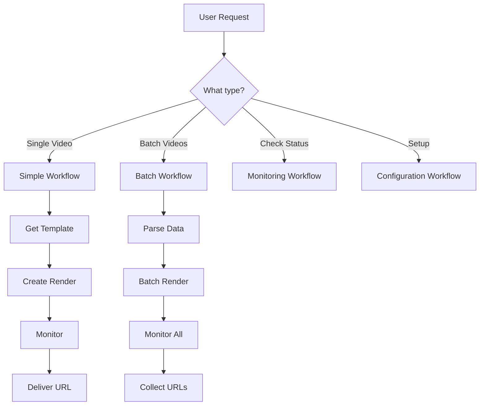

# Agent Workflows for Plainly MCP Server

This guide shows you how to build workflows for AI agents to use the Plainly MCP server effectively.

---

## Table of Contents
1. [Workflow Architecture](#workflow-architecture)
2. [Basic Workflows](#basic-workflows)
3. [Advanced Workflows](#advanced-workflows)
4. [Agent Prompt Templates](#agent-prompt-templates)
5. [Integration Patterns](#integration-patterns)
6. [Error Handling](#error-handling)

---

## Workflow Architecture

### Core Workflow Pattern
Every Plainly workflow follows this structure:

```
1. DISCOVERY → Find project/template
2. VALIDATION → Check parameters match template
3. EXECUTION → Create render(s)
4. MONITORING → Track progress
5. DELIVERY → Get video URLs
6. CLEANUP → Handle errors/retries
```

### Agent Decision Tree



---

## Basic Workflows

### Workflow 1: Single Video Creation

**Use Case:** Create one tutorial video with specific content

**Agent Instructions:**
```
When user requests a single video:
1. Use list_projects to show available projects
2. Ask user to select project (or use default if specified)
3. Use list_templates to show available templates for that project
4. Use get_template to see what parameters are needed
5. Ask user for parameter values OR use provided data
6. Use create_render with projectId and parameters
7. Use get_render every 10 seconds to check status
8. When status = "completed", provide video URL
9. If status = "failed", show error and suggest retry
```

**Example Agent Prompt:**
```
Create a JavaScript tutorial video with:
- Title: "Understanding Array.map()"
- Code: "const nums = [1,2,3]; nums.map(x => x * 2)"
- Explanation: "map() transforms each array element"
```

**Expected Agent Actions:**
```javascript
// Step 1: List projects
list_projects()
// Returns: [{ id: "abc-123", name: "JS Tutorials" }]

// Step 2: Get template details
get_template({ projectId: "abc-123", templateId: "template-xyz" })
// Returns: { parameters: ["title", "code", "explanation"] }

// Step 3: Create render
create_render({
  projectId: "abc-123",
  parameters: {
    title: "Understanding Array.map()",
    code: "const nums = [1,2,3]; nums.map(x => x * 2)",
    explanation: "map() transforms each array element"
  }
})
// Returns: { renderId: "render-456", status: "pending" }

// Step 4: Monitor (poll every 10s)
get_render({ renderId: "render-456" })
// Loop until: { status: "completed", videoUrl: "https://..." }

// Step 5: Deliver
"✅ Your video is ready: https://plainly.com/videos/render-456.mp4"
```

---

### Workflow 2: Batch Video Creation

**Use Case:** Create 50 tutorial videos from CSV/JSON data

**Agent Instructions:**
```
When user requests batch video creation:
1. Parse the input data (CSV, JSON, or spreadsheet)
2. Validate data structure has all required fields
3. Use get_template to verify field mappings
4. Split data into chunks of 50 (API limit)
5. For each chunk:
   a. Use batch_render with array of render requests
   b. Track all render IDs
6. Use list_renders to monitor all videos
7. When all complete, provide summary with URLs
8. If any failed, list them and offer retry
```

**Example Agent Prompt:**
```
Create tutorial videos from this CSV:

title,code,explanation
"Array.map()","const x = [1,2,3].map(n => n*2)","Transforms elements"
"Array.filter()","const x = [1,2,3].filter(n => n>1)","Filters elements"
"Array.reduce()","const x = [1,2,3].reduce((a,b) => a+b)","Reduces to value"
```

**Expected Agent Actions:**
```javascript
// Step 1: Parse CSV
const data = parseCSV(input)
// [{ title: "Array.map()", code: "...", explanation: "..." }, ...]

// Step 2: Validate template parameters
get_template({ projectId: "abc-123", templateId: "template-xyz" })
// Confirm: template needs "title", "code", "explanation" ✓

// Step 3: Create batch render
batch_render({
  renders: data.map(row => ({
    projectId: "abc-123",
    parameters: row,
    metadata: { batch: "tutorial-series-1" }
  }))
})
// Returns: [{ renderId: "r1" }, { renderId: "r2" }, { renderId: "r3" }]

// Step 4: Monitor batch
list_renders({ projectId: "abc-123", status: "processing" })
// Check every 30 seconds until all complete

// Step 5: Deliver summary
"✅ Batch complete: 3/3 videos rendered
- Array.map(): https://plainly.com/r1.mp4
- Array.filter(): https://plainly.com/r2.mp4
- Array.reduce(): https://plainly.com/r3.mp4"
```

---

### Workflow 3: Check Status & Resume

**Use Case:** Check what videos are rendering, resume failed ones

**Agent Instructions:**
```
When user asks "what's my status?" or "check my videos":
1. Use list_renders without filters to get ALL renders
2. Group by status: completed, processing, pending, failed
3. For completed: show count + provide URLs
4. For processing: show count + estimated time remaining
5. For pending: show count + position in queue
6. For failed: analyze errors and suggest fixes
7. Ask if user wants to retry failed renders
8. If yes, use retry_render for each failed ID
```

**Example Agent Prompt:**
```
Check my video status
```

**Expected Agent Actions:**
```javascript
// Step 1: Get all renders
list_renders()
// Returns: [{ status: "completed", ... }, { status: "failed", ... }]

// Step 2: Analyze and group
const summary = {
  completed: renders.filter(r => r.status === "completed"),
  processing: renders.filter(r => r.status === "processing"),
  failed: renders.filter(r => r.status === "failed")
}

// Step 3: Report
`📊 Render Status Report:

✅ Completed: ${summary.completed.length} videos
${summary.completed.map(r => `- ${r.name}: ${r.videoUrl}`).join('\n')}

🔄 Processing: ${summary.processing.length} videos
${summary.processing.map(r => `- ${r.name}: ${r.progress}%`).join('\n')}

❌ Failed: ${summary.failed.length} videos
${summary.failed.map(r => `- ${r.name}: ${r.error}`).join('\n')}

Would you like me to retry the failed videos?`

// Step 4: If user says yes
summary.failed.forEach(r => retry_render({ renderId: r.id }))
```

---

## Advanced Workflows

### Workflow 4: Multi-Format Video Creation

**Use Case:** Create same video in 4 aspect ratios (YouTube, Instagram, TikTok, Twitter)

**Agent Instructions:**
```
When user requests multi-format video:
1. Get the base content/parameters
2. Define aspect ratio variants:
   - 16:9 for YouTube
   - 1:1 for Instagram
   - 9:16 for TikTok/Stories
   - 4:5 for Facebook
3. Use batch_render with 4 different output configs
4. Tag each with metadata for tracking
5. Monitor all 4 renders
6. Provide organized URLs by platform
```

**Example:**
```javascript
const content = {
  title: "5 JavaScript Tips",
  subtitle: "Quick coding tricks",
  thumbnail: "https://example.com/thumb.jpg"
}

const platforms = [
  { name: "YouTube", aspectRatio: "16:9" },
  { name: "Instagram", aspectRatio: "1:1" },
  { name: "TikTok", aspectRatio: "9:16" },
  { name: "Facebook", aspectRatio: "4:5" }
]

batch_render({
  renders: platforms.map(platform => ({
    projectId: "abc-123",
    parameters: content,
    output: { aspectRatio: platform.aspectRatio },
    metadata: { platform: platform.name }
  }))
})
```

---

### Workflow 5: Personalization at Scale

**Use Case:** 1000 personalized videos with individual names

**Agent Instructions:**
```
When user requests personalized videos:
1. Load customer data (names, emails, custom messages)
2. Validate template has personalization fields
3. Split into chunks of 50 for batch processing
4. For each chunk:
   a. Create batch render
   b. Track render IDs
   c. Wait for completion
5. Store video URLs mapped to customer IDs
6. Generate delivery manifest (CSV/JSON)
7. Optionally trigger distribution (email, upload, etc.)
```

**Example:**
```javascript
// Customer data
const customers = [
  { id: 1, name: "John Smith", email: "john@example.com" },
  { id: 2, name: "Jane Doe", email: "jane@example.com" },
  // ... 998 more
]

// Process in chunks
const chunks = chunkArray(customers, 50) // 20 chunks

for (const chunk of chunks) {
  const batch = chunk.map(customer => ({
    projectId: "greeting-project",
    parameters: {
      recipientName: customer.name,
      message: `Hi ${customer.name}, thanks for being a customer!`
    },
    metadata: { customerId: customer.id }
  }))

  const results = await batch_render({ renders: batch })
  await monitorBatchCompletion(results)
}

// Generate manifest
const manifest = customers.map(c => ({
  customerId: c.id,
  name: c.name,
  videoUrl: getVideoUrl(c.id)
}))

saveCSV("video-manifest.csv", manifest)
```

---

### Workflow 6: A/B Testing Videos

**Use Case:** Test 3 different headlines to see which performs better

**Agent Instructions:**
```
When user requests A/B testing:
1. Get the base template and content
2. Define variants (different headlines, CTAs, colors, etc.)
3. Create one video per variant using batch_render
4. Tag each with variant identifier in metadata
5. Provide URLs organized by variant
6. Track which variant user deploys
7. Later, can analyze performance metrics
```

**Example:**
```javascript
const baseContent = {
  subtitle: "Learn JavaScript in 2024",
  code: "console.log('Hello World')",
  cta: "Subscribe for more"
}

const variants = [
  { id: "A", headline: "Master JavaScript Fast" },
  { id: "B", headline: "JavaScript Made Easy" },
  { id: "C", headline: "Learn JS Like a Pro" }
]

batch_render({
  renders: variants.map(variant => ({
    projectId: "abc-123",
    parameters: { ...baseContent, headline: variant.headline },
    metadata: { variant: variant.id, test: "headline-ab-test" }
  }))
})

// Result:
// Variant A: https://plainly.com/render-a.mp4
// Variant B: https://plainly.com/render-b.mp4
// Variant C: https://plainly.com/render-c.mp4
```

---

### Workflow 7: Scheduled Video Production

**Use Case:** Automatically create weekly tutorial videos

**Agent Instructions:**
```
Setup for scheduled production:
1. Create webhook with your server endpoint
2. Setup cron job to trigger workflow weekly
3. Workflow loads next topic from content calendar
4. Creates video with that week's content
5. Webhook notifies when video is ready
6. Auto-uploads to YouTube/social platforms
7. Sends notification to team
```

**Example Implementation:**
```javascript
// 1. Setup webhook
create_webhook({
  url: "https://myapp.com/webhooks/video-ready",
  events: ["render.completed"],
  active: true
})

// 2. Weekly cron job (runs every Monday 9am)
// Pseudo-code for agent's scheduled task
async function weeklyTutorialWorkflow() {
  // Get this week's topic from database
  const topic = await getNextTopic()

  // Create video
  const render = await create_render({
    projectId: "weekly-tutorials",
    parameters: {
      title: topic.title,
      content: topic.content,
      weekNumber: topic.week
    }
  })

  // Webhook will notify when ready
  // Webhook handler will then:
  // - Upload to YouTube
  // - Post to social media
  // - Send team notification
}
```

---

## Agent Prompt Templates

### Template 1: Tutorial Video Agent

```markdown
You are a Tutorial Video Production Agent using Plainly MCP Server.

Your workflow:
1. When user provides tutorial content, parse it into structured data
2. Map content to template parameters (title, code, explanation)
3. Validate all required fields are present
4. Create render using create_render tool
5. Monitor render progress every 10 seconds
6. Provide video URL when complete
7. If render fails, analyze error and suggest fixes

Example interaction:
User: "Create tutorial on Array.map()"
You:
- Parse topic: "Array.map()"
- Get template parameters
- Create render with:
  * title: "Understanding Array.map()"
  * code: [generate example code]
  * explanation: [generate explanation]
- Monitor until complete
- Deliver URL

Always be proactive about error handling and provide clear status updates.
```

### Template 2: Batch Production Agent

```markdown
You are a Batch Video Production Agent using Plainly MCP Server.

Your workflow:
1. Accept data in CSV, JSON, or spreadsheet format
2. Parse and validate data structure
3. Check template compatibility with get_template
4. Split data into batches of 50 videos max
5. Process each batch with batch_render
6. Track all render IDs across batches
7. Monitor batch progress and report status
8. Compile final list of video URLs
9. Generate delivery manifest

Key capabilities:
- Handle data validation and cleaning
- Chunk large datasets appropriately
- Provide progress updates during batch processing
- Retry failed renders automatically
- Generate structured output (CSV/JSON)

Error handling:
- If batch partially fails, identify failed items
- Suggest data corrections for validation errors
- Retry failed renders up to 3 times
- Report final success/failure stats
```

### Template 3: Status Monitor Agent

```markdown
You are a Video Status Monitor Agent using Plainly MCP Server.

Your workflow:
1. Use list_renders to get all current renders
2. Group by status: completed, processing, pending, failed
3. Calculate statistics and metrics
4. Provide organized status report
5. Proactively suggest actions for failed renders
6. Estimate completion times for processing renders

Status Report Format:
```
📊 Video Production Status

✅ Completed: X videos
[List with URLs]

🔄 Processing: Y videos (avg Z% complete)
[List with progress bars]

⏳ Pending: A videos (est. B minutes)
[Queue position info]

❌ Failed: C videos
[List with error analysis]

💡 Recommendations:
- [Actionable suggestions]
```

Always provide actionable insights, not just raw data.
```

---

## Integration Patterns

### Pattern 1: CMS Integration

Connect your Content Management System to auto-create videos:

```javascript
// When new blog post published in CMS:
CMS.onPublish(async (post) => {
  // Extract key points
  const keyPoints = extractKeyPoints(post.content)

  // Create summary video
  const render = await create_render({
    projectId: "blog-summaries",
    parameters: {
      title: post.title,
      author: post.author,
      keyPoints: keyPoints.join(", "),
      thumbnail: post.featuredImage
    }
  })

  // Wait for completion
  const video = await monitorRender(render.renderId)

  // Update post with video
  await CMS.updatePost(post.id, { videoUrl: video.videoUrl })
})
```

### Pattern 2: Course Platform Integration

Auto-generate lesson videos when instructor uploads content:

```javascript
// When lesson created in LMS:
LMS.onLessonCreate(async (lesson) => {
  const render = await create_render({
    projectId: "course-lessons",
    parameters: {
      lessonTitle: lesson.title,
      instructor: lesson.instructor,
      courseCode: lesson.code,
      duration: lesson.duration
    }
  })

  const video = await monitorRender(render.renderId)

  await LMS.attachVideo(lesson.id, video.videoUrl)
  await LMS.notifyStudents(lesson.id, "New video lesson available!")
})
```

### Pattern 3: Social Media Automation

Schedule and publish videos to multiple platforms:

```javascript
// Daily social media video workflow
async function dailySocialVideo() {
  // Get today's content
  const content = await getTodaysContent()

  // Create multi-format videos
  const batch = await batch_render({
    renders: [
      { projectId: "social", parameters: content, output: { aspectRatio: "16:9" } },
      { projectId: "social", parameters: content, output: { aspectRatio: "1:1" } },
      { projectId: "social", parameters: content, output: { aspectRatio: "9:16" } }
    ]
  })

  // Wait for all to complete
  const videos = await Promise.all(
    batch.map(r => monitorRender(r.renderId))
  )

  // Publish to platforms
  await YouTube.upload(videos[0].videoUrl)
  await Instagram.upload(videos[1].videoUrl)
  await TikTok.upload(videos[2].videoUrl)
}
```

---

## Error Handling

### Common Errors & Agent Responses

#### Error 1: Invalid Parameters
```
Error: "Parameter 'code_snippet' is required but not provided"

Agent Action:
1. Check template with get_template
2. Identify missing parameter
3. Ask user: "I need the code_snippet parameter. What code should I use?"
4. Retry with complete parameters
```

#### Error 2: Render Failed
```
Error: "Render failed: Image URL not accessible"

Agent Action:
1. Identify problematic parameter (image URL)
2. Verify URL accessibility with HEAD request
3. Suggest: "The image at [URL] is not accessible. Please provide a public HTTPS URL."
4. Offer to retry once URL is fixed
```

#### Error 3: Template Not Found
```
Error: "Template xyz-789 not found in project abc-123"

Agent Action:
1. Use list_templates to show available templates
2. Ask user: "I couldn't find that template. Here are the available options:"
3. Let user select correct template
4. Retry workflow with correct template ID
```

### Retry Strategy

```javascript
async function resilientRender(params, maxRetries = 3) {
  for (let attempt = 1; attempt <= maxRetries; attempt++) {
    try {
      const render = await create_render(params)
      const result = await monitorRender(render.renderId)

      if (result.status === "completed") {
        return result.videoUrl
      }

      if (result.status === "failed") {
        if (attempt < maxRetries) {
          console.log(`Attempt ${attempt} failed, retrying...`)
          await sleep(5000 * attempt) // Exponential backoff
          continue
        }
        throw new Error(`Render failed after ${maxRetries} attempts`)
      }
    } catch (error) {
      if (attempt === maxRetries) throw error
      await sleep(5000 * attempt)
    }
  }
}
```

---

## Best Practices for Agent Workflows

### 1. Always Validate First
```javascript
// ❌ Bad: Create render without validation
create_render({ projectId, parameters: userInput })

// ✅ Good: Validate against template first
const template = await get_template({ projectId, templateId })
const validated = validateParameters(userInput, template.parameters)
create_render({ projectId, parameters: validated })
```

### 2. Provide Status Updates
```javascript
// ✅ Keep user informed
console.log("🔍 Finding your project...")
console.log("📋 Checking template parameters...")
console.log("🎬 Creating render...")
console.log("⏳ Rendering video (this may take 2-5 minutes)...")
console.log("✅ Video ready!")
```

### 3. Handle Errors Gracefully
```javascript
try {
  const render = await create_render(params)
} catch (error) {
  if (error.message.includes("Project not found")) {
    return "❌ That project doesn't exist. Let me show you available projects..."
  } else if (error.message.includes("Invalid parameter")) {
    return "❌ The template is missing required data. Let me check what's needed..."
  } else {
    return `❌ Unexpected error: ${error.message}. Let me try a different approach...`
  }
}
```

### 4. Monitor Efficiently
```javascript
// ❌ Bad: Poll too frequently
while (true) {
  await sleep(1000) // Every second - wastes API calls
  const status = await get_render({ renderId })
}

// ✅ Good: Smart polling with backoff
let interval = 5000 // Start at 5 seconds
while (status !== "completed") {
  await sleep(interval)
  status = await get_render({ renderId })
  interval = Math.min(interval * 1.2, 30000) // Cap at 30s
}
```

### 5. Use Metadata for Tracking
```javascript
// ✅ Tag renders for easy filtering
create_render({
  projectId: "abc-123",
  parameters: { ... },
  metadata: {
    batch: "tutorial-series-1",
    episode: 5,
    topic: "array-methods",
    createdBy: "automation-agent",
    priority: "high"
  }
})

// Later: Filter by metadata
list_renders({ metadata: { batch: "tutorial-series-1" } })
```

---

## Testing Your Agent Workflows

### Test Checklist

- [ ] Single video creation works end-to-end
- [ ] Batch rendering handles 50+ videos
- [ ] Error handling catches common failures
- [ ] Status monitoring provides accurate info
- [ ] Retry logic recovers from transient errors
- [ ] Progress updates are clear and helpful
- [ ] Video URLs are validated before delivery
- [ ] Metadata tracking works correctly

### Test Script Example

```javascript
async function testAgentWorkflow() {
  console.log("🧪 Testing Agent Workflow...\n")

  // Test 1: Single video
  console.log("Test 1: Single Video Creation")
  const render1 = await create_render({
    projectId: "test-project",
    parameters: { title: "Test Video" }
  })
  console.log(render1.status === "pending" ? "✅ Pass" : "❌ Fail")

  // Test 2: Batch videos
  console.log("\nTest 2: Batch Video Creation")
  const batch = await batch_render({
    renders: Array(3).fill(null).map((_, i) => ({
      projectId: "test-project",
      parameters: { title: `Test Video ${i+1}` }
    }))
  })
  console.log(batch.length === 3 ? "✅ Pass" : "❌ Fail")

  // Test 3: Status check
  console.log("\nTest 3: Status Check")
  const renders = await list_renders()
  console.log(Array.isArray(renders) ? "✅ Pass" : "❌ Fail")

  console.log("\n✅ All tests complete!")
}
```

---

## Quick Reference: Agent Decision Matrix

| User Says | Agent Should |
|-----------|--------------|
| "Create a video about X" | → Single video workflow |
| "Create videos from this CSV" | → Batch workflow |
| "What's my status?" | → Status monitoring workflow |
| "Why did this fail?" | → Error analysis workflow |
| "Create X in multiple formats" | → Multi-format workflow |
| "Setup weekly automation" | → Scheduled workflow + webhook |
| "Test 3 different versions" | → A/B testing workflow |
| "Create 1000 personalized videos" | → Personalization workflow |

---

## Next Steps

1. **Choose a workflow** that matches your use case
2. **Adapt the agent prompt template** for your needs
3. **Test with small batches first** (3-5 videos)
4. **Scale up gradually** once validated
5. **Monitor and optimize** based on results

Your Plainly MCP server is ready. Your agent workflows are ready. Time to automate your video production! 🚀
